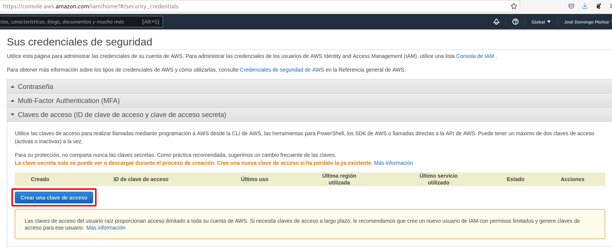
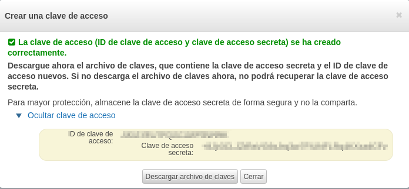
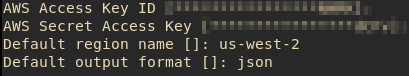
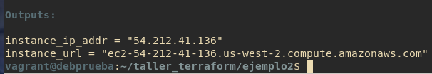
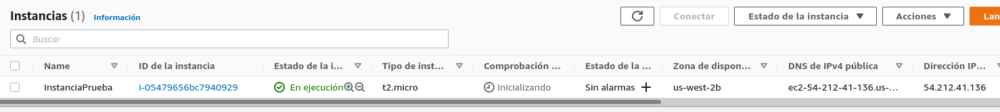
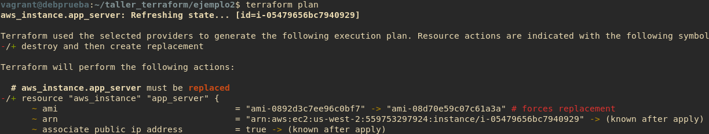
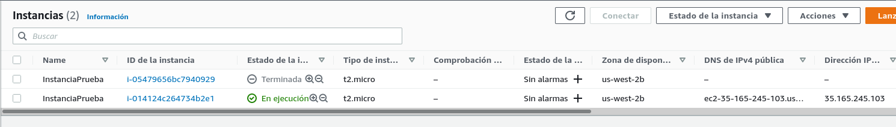

# Ejemplo 2: Creación de una instancia aws

Lo primero que vamos a hacer es crear un token de acceso para que terraform pueda acceder a nuestra cuenta de aws. Y vamos a guardar las credenciales en nuestro ordenador:





```
aws configure
```



## Fichero main.tf

Podemos ver el fichero [`main.tf`](https://github.com/josedom24/taller_terraform/blob/main/ejemplo2/main.tf).

Y ejecutamos el despliegue:

```
terraform init
terrafom apply
```

En el fichero [`outputs.tf`](https://github.com/josedom24/taller_terraform/blob/main/ejemplo2/outputs.tf) podemos configurar las variables que quiero que me muestre al finalizar el despliegue.



Y vemos que se ha creado una instancia:



Y comprobamos que podemos acceder:

```
$ ssh ubuntu@54.212.41.136
Enter passphrase for key '/home/vagrant/.ssh/id_rsa': 
Welcome to Ubuntu 20.04.3 LTS (GNU/Linux 5.11.0-1022-aws x86_64)

...

ubuntu@ip-172-31-27-39:~$ 
```

Podemos inspeccionar el escenario montado:

```
terraform show
```

## Cambiando la infraestructura

En cualquier momento podemos cambiar la configuración del despliegue. A medida que cambias las configuraciones de Terraform, Terraform construye un plan de ejecución que sólo modifica lo necesario para alcanzar el estado deseado.

En ocasiones, un cambio conllevará la creación de una nueva máquina, en otras ocasiones el cambio se hará sobre la instancia creada.

Por ejemplo si cambiamos la imagen del despliegue y ponemos la `ami-08d70e59c07c61a3a` (Ubuntu 16.04):



Y ejecutamos `terraform apply` para cambiar el despliegue y comprobamos que se ha creado una nueva instancia:



Realmente cuando ejecutamos un `terraform apply` previamente se ejecuta un `terraform plan` que genera el **plan de ejecución**, donde se indica los recursos que se van a crear, se van a modificar y se van a destruir. Finalmente cuando se aplica el plan el estado del despliegue se guarda en el fichero `terraform.tfstate`. si guardamos este fichero en un repositorio, podremos controlar los cambios que se van produciendo en nuestro despliegue y se podrá replicar el despliegue en cualquier momento.


## Eliminar el despliegue

Tanto los cambios, como la destrucción del escenario necesita que el fichero de estado `terraform.tfstate` exista en el directorio.

```
terraform destroy
```

