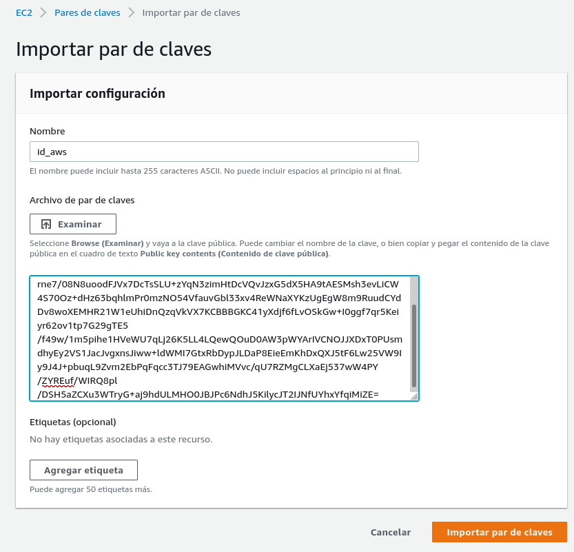

# Ejemplo 2: Configuración de una instancia aws

Para crear y configurar una instancia aws necesitamos acceder con una clave privada que no tenga frase de paso.

Vamos a generar una nueva par de claves y vamos a subir a aws nuestra clave pública:



A continuación vamos a parametrizar el despliegue, para ello creamos el fichero [`variables.tf`](https://github.com/josedom24/taller_terraform/blob/main/ejemplo3/variables.tf) donde podenemos los parámetros con los que queremos trabajar.

En el fichero [`main.tf`](https://github.com/josedom24/taller_terraform/blob/main/ejemplo3/main.tf) se harán referencia a estos parámetros.

Además en el fichero `main.tf` hemos incluido dos acciones que nos van a configurar la instancias:

```

