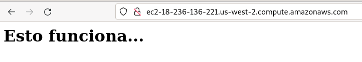

# Ejemplo 3: Configuración de una instancia aws

Para crear y configurar una instancia aws necesitamos acceder con una clave privada que no tenga frase de paso.

Vamos a generar una nueva par de claves y vamos a subir a aws nuestra clave pública:


A continuación vamos a parametrizar el despliegue, para ello creamos el fichero [`variables.tf`](https://github.com/josedom24/taller_terraform/blob/main/ejemplo3/variables.tf) donde podenemos los parámetros con los que queremos trabajar.

En el fichero [`main.tf`](https://github.com/josedom24/taller_terraform/blob/main/ejemplo3/main.tf) se harán referencia a estos parámetros.

Además en el fichero `main.tf` hemos incluido dos acciones que nos van a configurar la instancias:

```
# Copies the file as the root user using SSH
  provisioner "file" {
    source = "index.html"
    destination = "/tmp/index.html"
    connection {
        type = "ssh"
        user = "ubuntu"
        host =  self.public_ip
        private_key = file(pathexpand("~/.ssh/id_aws"))
        }
  
}

  provisioner "remote-exec" {
    connection {
        type = "ssh"
        user = "ubuntu"
        host =  self.public_ip
        private_key = file(pathexpand("~/.ssh/id_aws"))
        }
    inline = [
      "sudo apt-get update",
      "sudo apt-get -y install apache2",
      "sudo cp /tmp/index.html /var/www/html",
    ]
  }
  ```

  Ejecutamos el despliegue:

  ```
  terraform init
  terraform apply
  ```

  Las salidas que nos da el despliegue son:

  ```
  Outputs:

instance_ip_addr = "18.236.136.221"
instance_url = "ec2-18-236-136-221.us-west-2.compute.amazonaws.com"
```

Y comprobamos que se ha instalado un apache2 y se ha copiado un index.html:


